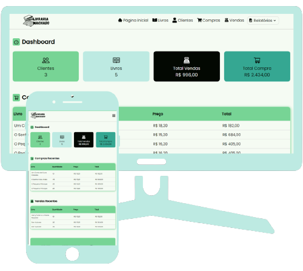

# Bookstore Management Web App

The Bookstore Management Web App is a comprehensive solution for managing book inventory, tracking sales and purchases, registering customers, and generating various reports. It is designed to provide a user-friendly interface for efficient stock control and business insights.

## Table of Contents

- [Bookstore Management Web App](#bookstore-management-web-app)
  - [Table of Contents](#table-of-contents)
  - [Description](#description)
  - [Technologies Used](#technologies-used)
    - [Back-end](#back-end)
    - [Front-end](#front-end)
  - [Deployment](#deployment)
  - [Installation](#installation)
  - [Usage](#usage)
  - [Authors](#authors)
  - [Contact](#contact)
  
## Description

The Bookstore Management Web App is a modern and feature-rich application that simplifies the complexities of bookstore management. Whether you're a small independent bookstore or a larger establishment, this app offers a seamless experience for handling your book-related operations.

Key features include:

- **Inventory Control:** Easily manage your book inventory, add new books, update quantities, and track stock levels.
  
- **Sales and Purchases:** Record sales transactions, manage purchases, and keep a detailed history of all financial transactions.

- **Customer Registration:** Efficiently register and manage customer information for a personalized experience.

- **Reports and Insights:** Generate reports on sales by customers, overall sales, purchases, and more to gain valuable business insights.

Key features include:

- **Inventory Control:** Easily manage your book inventory, add new books, update quantities, and track stock levels.
  
- **Sales and Purchases:** Record sales transactions, manage purchases, and keep a detailed history of all financial transactions.

- **Customer Registration:** Efficiently register and manage customer information for a personalized experience.

## Technologies Used

### Back-end

- **JDK 15:** Development environment for building applications using the Java programming language.
- **Spring Boot:** Application framework and inversion of control container for the Java platform.
- **Maven:** Software project management and comprehension tool.
- **Postman:** API platform for designing, building, testing, and iterating APIs.
- **H2Database:** Relational database management system written in Java.
- **PostgreSQL:** Free and open-source relational database management system.

### Front-end

- **HTML:** Standard markup language for documents designed to be displayed in a web browser.
- **CSS:** Style sheet language used for describing the presentation of a document.
- **JavaScript:** Programming language core to the World Wide Web.
- **React.JS:** A free and open-source front-end JavaScript library for building user interfaces based on UI components.
- **Netlify:** Cloud computing company offering hosting and serverless backend services.

## Deployment

The web app is hosted on [Netlify](https://bookstore-jonas.netlify.app/) for the front-end and [Render.com](https://backend-bookstore-fwwu.onrender.com/) for the back-end.

## Installation

To set up the Bookstore Management Web App, follow these steps:

1. **Clone the repository** or download the latest release.
2.  **Install JDK 15** for the backend development environment.
3. **Set up Spring Boot** and configure the database (H2Database for development, PostgreSQL for production).
4. **Install Node.js and Yarn** for the frontend development environment.
5. **Navigate to the project directory** and run the necessary commands to install dependencies.

## Usage

Once the installation is complete, follow these steps to use the Bookstore Management Web App:

1. Start the Spring Boot backend server.
2. Start the React frontend application.
3. Access the web app through your browser.
4. Register customers, add books to inventory, and manage sales and purchases.
5. Explore the reporting features to gain insights into business performance.
   
## Authors

- [Jonas Machado](https://github.com/jonasmachados)

## Contact

For inquiries, please contact the project maintainers at [jonasmachado.ti@gmail.com](mailto:jonasmachado.ti@gmail.com).
